<!--
Copyright 2021-2022 Xilinx Inc.

Licensed under the Apache License, Version 2.0 (the "License");
you may not use this file except in compliance with the License.
You may obtain a copy of the License at

http://www.apache.org/licenses/LICENSE-2.0

Unless required by applicable law or agreed to in writing, software
distributed under the License is distributed on an "AS IS" BASIS,
WITHOUT WARRANTIES OR CONDITIONS OF ANY KIND, either express or implied.
See the License for the specific language governing permissions and
limitations under the License.

Authors: Daniele Bagni, Peter Schillinger, Herve Ratigner, Kay Migge, Xilinx Inc
Acknowledgements: Srikanth Erusalagandi, Tony McDowell, Florent Werbrouck, Xilinx Inc
-->

<table class="sphinxhide">
 <tr>
    <td align="center"><h1>Vitis AI 1.4&trade; Machine Learning Tutorials</h1>
    <a href="https://www.xilinx.com/products/design-tools/vitis.html">See Vitis&trade; Development Environment on xilinx.com</br></a>
    <a href="https://www.xilinx.com/products/design-tools/vitis/vitis-ai.html">See Vitis AI&trade; Development Environment on xilinx.com</a>
    </td>
 </tr>
</table>

# Pre- and Post-processing PL Accelerators for ML with Versal DPU

## Current status


1. Embedded system designed with Vitis 2020.2 environment.

2. Tested in hardware on VCK190PP with ``XVDPU TRD`` platform.


#### Last update  

02 December 2021


## 1 Introduction

This repository contains the Pre- and Post-processing kernels to be used in Machine Learning (ML) jointly with the Deep learning Processor Unit (DPU) to accelerate the Programmable Logic (PL). These tasks are otherwise executed by the ARM host CPU of the FPGA target device. Off-loading those two tasks from the ARM® CPU improves the overall system performance in terms of frames-per-second (fps).

The two accelerators were tested using data coming from the Semantic Segmentation CNN of this tutorial:
[VAI-KERAS-FCN8-SEMSEG](https://github.com/Xilinx/Vitis-AI-Tutorials/tree/master/Design_Tutorials/05-Keras_FCN8_UNET_segmentation), where the CNN was retrained with larger image sizes of 1920x832. However, the accelerators are general enough to be used or easily adapted with few changes also to other Deep Learning applications, such as Object Detection or Image Classification.

At the moment we are targeting the VCK190 Pre-Production (PP) board, with the ``XVDPU TRD`` platform, which contains a DPU designed with 96 AI Engine cores (over the 400 available) besides other PL resources (BRAMs, URAMs, FFs, LUTs, DSPs).

The two accelerators do not use any core from the AI Engine array of the Versal&trade; ACAP, to be more portable later also on MPSoC devices. Their design is done with Vitis High Level Synthesis (HLS) within the Vitis&trade; suite.

The application running on the host ARM CPU applies XRT APIs.

This tutorial is also a complete example of using the [WAA](https://github.com/Xilinx/Vitis-AI/tree/master/demo/Whole-App-Acceleration) flow with Vitis 2020.2, targeting the VCK190 PP board.

There are two major commands that basically run all what is explained in the following sections:

```shell
cd VDPU-PRE-POST-PLACC/files # you are supposed to be here
# whole section 2
source ./run_hls_projects.sh
# whole section 4
cd makefile_flow
source ./run_makefile_flow.sh
```


## 1.1 Important

Everything shown in this project was done on an Ubuntu 10.04.7 desktop with the related Vitis 2020.2 suite. This project was never tried on a Windows PC.


## 1.3 Dos-to-Unix Conversion

If you run into unexpected errors during the execution of the scripts, you have to pre-process -all the``*.sh``, ``*.cpp``, ``*.h`` files once with the [dos2unix](http://archive.ubuntu.com/ubuntu/pool/universe/d/dos2unix/dos2unix_6.0.4.orig.tar.gz) utility.
Run the following commands from your Ubuntu host PC (out of the Vitis AI docker images):
```bash
#sudo apt-get install dos2unix
cd <WRK_DIR> #your working directory
for file in $(find . -name "*.sh" ); do dos2unix ${file}; done
for file in $(find . -name "*.tcl"); do dos2unix ${file}; done
for file in $(find . -name "*.h"  ); do dos2unix ${file}; done
for file in $(find . -name "*.c*" ); do dos2unix ${file}; done
```


# 2 Design Flow with HLS

For each accelerator there are two project folders named [hls](files/preproc/hls) and [vitis](files/preproc/vitis), respectively, with the source files adopted in the standalone HLS design and in the final Vitis system design.

For each accelerator, the files are the same among the two subfolders. The only difference is that the [vitis](files/preproc/vitis) folder also requires the ARM host code with XRT APIs. It is not needed  
by the [vitis_hls](files/preproc/vitis_hls) folder. Therefore, the file [dpupreproc_defines.h](files/preproc/vitis/kernels/dpupreproc_defines.h) must have the line ``#define ARM_HOST`` commented when used in the kernels subproject. Remove the commenting while using it in the host code, as shown here: [dpupreproc_defines.h](files/preproc/vitis/host/dpupreproc_defines.h). The only difference between these two files is that they have the same name and are placed in different folders.

The same concept is also valid for the post-processing kernel and its related folders [hls](files/postproc/hls) and [vitis](files/postproc/vitis), respectively, for the source files adopted in the standalone HLS design and  the final Vitis system design.


**Important:** To avoid proliferation of files with the same name, this tutorial uses soft links for the common files between standalone HLS and the Vitis project. Run the following command before reading the rest of this document:

```shell
cd VDPU-PRE-POST-PLACC/files
bash -x ./prepare_files
```

## 2.1 Pre-Processing the Kernel


### 2.1.1 Kernel Functionality

In ML, the preprocessing job has to change the statistics on the data used for training the CNN to facilitate such training.
There are many ways to do the preprocessing, and the most popular methods are the following two explained with Python code fragments, the Caffe and TensorFlow mode, respectively.

```python
. . .
if (TensorFlow_preproc): #TensorFLow mode
  _B_MEAN = 127.5
  _G_MEAN = 127.5
  _R_MEAN = 127.5
  MEANS = [_B_MEAN, _G_MEAN, _R_MEAN]
  SCALES = [0.007843137, 0.007843137, 0.007843137] # 1.0/127.5
else: #Caffe mode
  _B_MEAN = 104.0
  _G_MEAN = 117.0
  _R_MEAN = 123.0
  MEANS = [_B_MEAN, _G_MEAN, _R_MEAN]
  SCALES = [1.0, 1.0, 1.0]
. . .
def preprocess_one_image_fn(image_path, pre_fix_scale, width, height):
    means = MEANS
    scales = SCALES
    image = cv2.imread(image_path)
    image = cv2.resize(image, (width, height))
    B, G, R = cv2.split(image)
    B = (B - means[0]) * scales[0] * pre_fix_scale
    G = (G - means[1]) * scales[1] * pre_fix_scale
    R = (R - means[2]) * scales[2] * pre_fix_scale
    image = cv2.merge([R, G, B])
    image = image.astype(np.int8)
    return image
```

Usually, in Caffe, the RGB pixels of the input image are manipulated by subtracting the RGB mean values (``MEANS``) of all the training dataset images. The output data is of ``signed char`` (in C/C++) or ``int8`` (python numpy) type, with a possible range from -128 to +127, being 8-bit.
On the other hand,  in TensorFlow, the pixels are manipulated by normalizing them in the interval from -1.0 to 1.0.

The pre-processing works on floating-point data during the CNN training phase, but the DPU works with int8 after quantization with the [Vitis AI tools] (https://github.com/Xilinx/Vitis-AI/tree/master/tools/Vitis-AI-Quantizer) in real life. So, in the application running on the target device in real-time, you have to scale the data with the `pre_fix_scale` parameter that comes from a query to the DPU before starting the ML prediction (inference) task. It can be done with Python code similar to this:

```python
input_fixpos = all_dpu_runners[0].get_input_tensors()[0].get_attr("fix_point")
pre_fix_scale = 2**input_fixpos
```

In conclusion, before starting its job,  the image pre-processing module requires 6 floating point input parameters:
```
float MEANS[3];
float SCALES[3];
```
The scaling factor could be either
``float pre_fix_scale;``
or
``int input_fixpos;``
The last one is a value from 1 to 7 because it represents the exponent ``i`` of a power of ``2,`` that is ``2^i``.    

In the HLS TestBench (TB), all those parameters are fixed in the [dpupreproc_defines.h](files/preproc/vitis/kernels/dpupreproc_defines.h) file, to test the functionality of the core.

The input image used in the self-checking TB was taken from the test dataset of the
[VAI-KERAS-FCN8HDTV-SEMSEG](https://gitenterprise.xilinx.com/danieleb/VAI-KERAS-FCN8HDTV-SEMSEG) CNN.


### 2.1.2 HLS Design

After setting up the Vitis environment, launch the following command:
```shell
cd VDPU-PRE-POST-PLACC/files # you are supposed to be here
cd preproc/hls
vitis_hls -f hls_script.tcl
```
The whole HLS flow will run in its steps: CSIM, SYN, coSIM and IMP. See the related screenshots of Figures 1, 2, 3 and 4.


*Figure 1. Pre-processing CSIM step with Vitis HLS*


*Figure 2. Pre-processing SYN step with Vitis HLS*


*Figure 3. Pre-processing coSIM step with Vitis HLS*

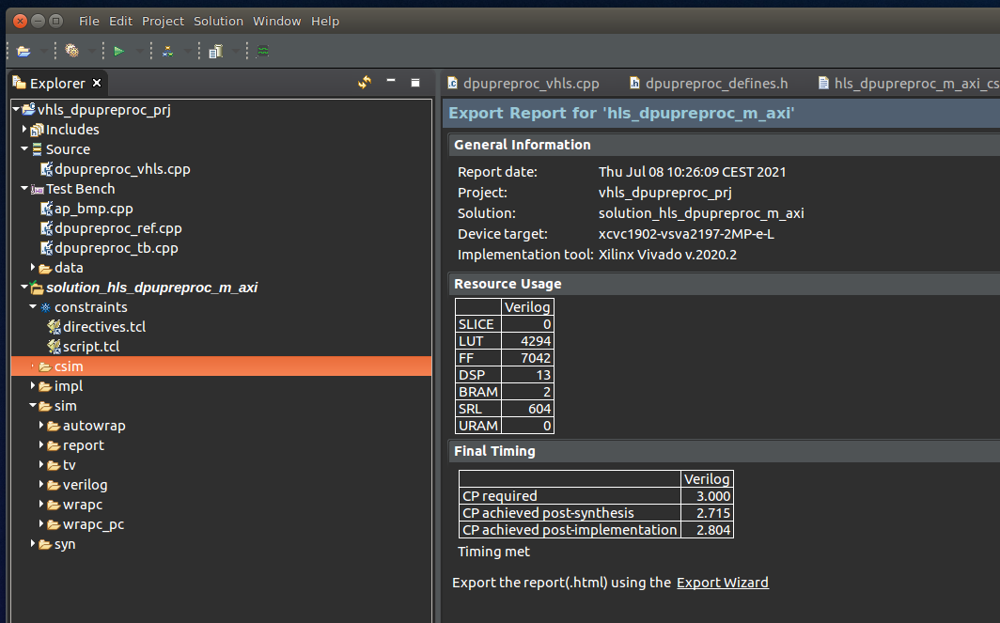

*Figure 4. Pre-processing IMP step with Vitis HLS*


**Note:** The [dpupreproc_defines.h](files/preproc/hls/src/dpupreproc_defines.h) file should have the line ``#define ARM_HOST`` commented.

As you see from figure 4, after Place-And-Route, the accelerator consumes the following resources: 4294 LUT, 7042 FF, 2 BRAM, and 13 DSP from the  Versal&trade; 1902 device  with a minimum clock period of 2.8ns, which corresponds to  356MHz maximum clock frequency.

Figure 3 reports the cycle accurate simulation (coSIM step), considering the amount of clock cycles to process the whole image before sending it back to DDR memory. The latency of this kernel is  given by 1198260 (cycles) x 2.8ns (clock period) = 3.359ms.

Even assuming a longer clock period of 5ns (corresponding to 200MHz clock frequency), the latency becomes 5.99ms.

**Note:** This latency is the time to process the entire frame (1920x832x3) of pixels because this is the way Vitis HLS works if you want to do a functional cycle accurate simulation (acknowledged as "coSIM") of the accelerator. But this core in itself has a real latency of few dozens of clock cycles. Such effective latency could be exploited either by using AXI4 Streaming interfaces (which are not accepted by the DPU core as they cannot work in a streaming mode) instead of full MAXI4 interfaces or by adding a ping-pong buffer of few image lines among the Pre-processing accelerator and the external DDR memory.  


## 2.2 Post-processing Kernel


### 2.2.1 Kernel Functionality

In ML, the post-processing job has to present the "features map" generated by the CNN in a form that can be understood by human beings. In case of Semantic Segmentation, this requires an understanding of which pixel of the image belongs to which class.

In this application case, there are 12 effective classes in a maximum amount of 28 classes per each pixel. So, the output tensor generated by the DPU is a 3D volume with half the horizontal and vertical size of the input images: 1920/2 and 832/2 respectively and 28 channels.

For each set of 28 values related to one pixel, the post-processing task computes the Softmax classifier first and then searches for its maximum value and related index: the index of this max value represent the object class (coded with a number from 0 to 27) with the highest probability to be predicted by the CNN. This can be illustrated by looking at the C/C++ code of the file [dpupostproc_ref.cpp](files/postproc/common_src/dpupostproc_ref.cpp):

```
void ref_SoftMax(signed char  *inp_data, float *out_data, float post_scale_factor, unsigned char size)
{
  float result[MAX_NUM_OF_CLASSES];
  float sum = 0.0f;
  for (int i=0; i<size; i++) {
	  int addr = 128+inp_data[i];
	  assert( (addr>=0) & (addr<=255) );
    float x = addr*post_scale_factor;
    result[i]= expf(x);
    sum += result[i];
  }
  float div = 1.0f / sum;
  for (int i=0; i<size; i++)
    out_data[i]=result[i] * div;
}

void ref_ArgMax(float *inp_data, unsigned char *out_max, unsigned char *out_index, unsigned char size)
{
  unsigned char  max=0, index=0;
  for (int i=0; i<size; i++) {
    float val = inp_data[i];
    val = val * 255.0f;
    int i_val = (int) val;
    assert( (i_val<=255) & (i_val>=0) );
    unsigned char u_val = i_val;
    if (u_val > max) {
    	max = u_val;
    	index = i;
    }
  }
  *out_index = index;
  *out_max = max;
}

void ref_dpupostproc(signed char *inp_data, unsigned char *out_max,
     unsigned char *out_index, float post_scale_factor, unsigned short int height, unsigned short int width)
{
  unsigned short int rows = height;
  unsigned short int cols = width;
  unsigned short int size = MAX_NUM_OF_CLASSES;

  float softmax[MAX_NUM_OF_CLASSES];
  signed char ch_vect[MAX_NUM_OF_CLASSES];
  unsigned char index, max;

  for (int r = 0; r < rows; r++) {
    for (int c = 0; c < cols; c++) {
      for(int cl=0; cl<size; cl++) {
    	  signed char  tmp_data  = inp_data[r*POST_MAX_WIDTH*MAX_NUM_OF_CLASSES + c*MAX_NUM_OF_CLASSES + cl];
    	  ch_vect[cl] =  tmp_data;
      }
      ref_SoftMax(ch_vect, softmax, post_scale_factor, size);
      ref_ArgMax(softmax, &max, &index, size);
      out_max[  r*POST_MAX_WIDTH + c] = (unsigned char) max;
      out_index[r*POST_MAX_WIDTH + c] = index;
    }
  }
}
```

As already done for the pre-processing, in this case there is a need to scale the data generated by the DPU before inputting them into the SoftMax classifier. It is done with the ``post_scale_factor`` parameter that comes from a query to the DPU at run time, with a Python code similar to this:

```python
output_fixpos = outputTensors[0].get_attr("fix_point")
post_scale_fact = 1 / (2**output_fixpos)
```

**Note**: The ``output_fixpos`` is a value from 1 to 7 because it represents the exponent ``i`` of a power of ``2,`` that is ``2^i``.    

The SoftMax function is computed by a Look Up Table (LUT) because there are 7 possible ``output_fixpos`` values the file [luts.h](files/postproc/common_src/luts.h) contains, which are 7 different LUTs and one for each value.

In the HLS TB this parameter is fixed in the [dpupostproc_defines.h](files/postproc/vitis/kernels/dpupostproc_defines.h) file, to test the functionality of the core.

The input data used in the HLS self-checking TB were taken by running the CNN ``XMODEL`` generated in the [VAI-KERAS-FCN8HDTV-SEMSEG](https://gitenterprise.xilinx.com/danieleb/VAI-KERAS-FCN8HDTV-SEMSEG) tutorial directly on the VCK190 board at run time. They were saved as ``npy`` (python numpy) files, then converted in ``mat`` (MATLAB) files, and finally in ``.txt`` text files.


**Note:** The ARM CPU could compute all the Look Up Table and send it to the post-processor as an alternative architectural choice to save BRAMs

### 2.2.2 HLS Design

After setting up the Vitis environment,  run the following command:
```shell
cd VDPU-PRE-POST-PLACC/files # you are supposed to be here
cd postproc/hls
vitis_hls -f hls_script.tcl
```
The whole HLS flow will run in its steps: CSIM, SYN, coSIM, and IMP.
See the related screenshots of Figures 5, 6, 7 and 8.


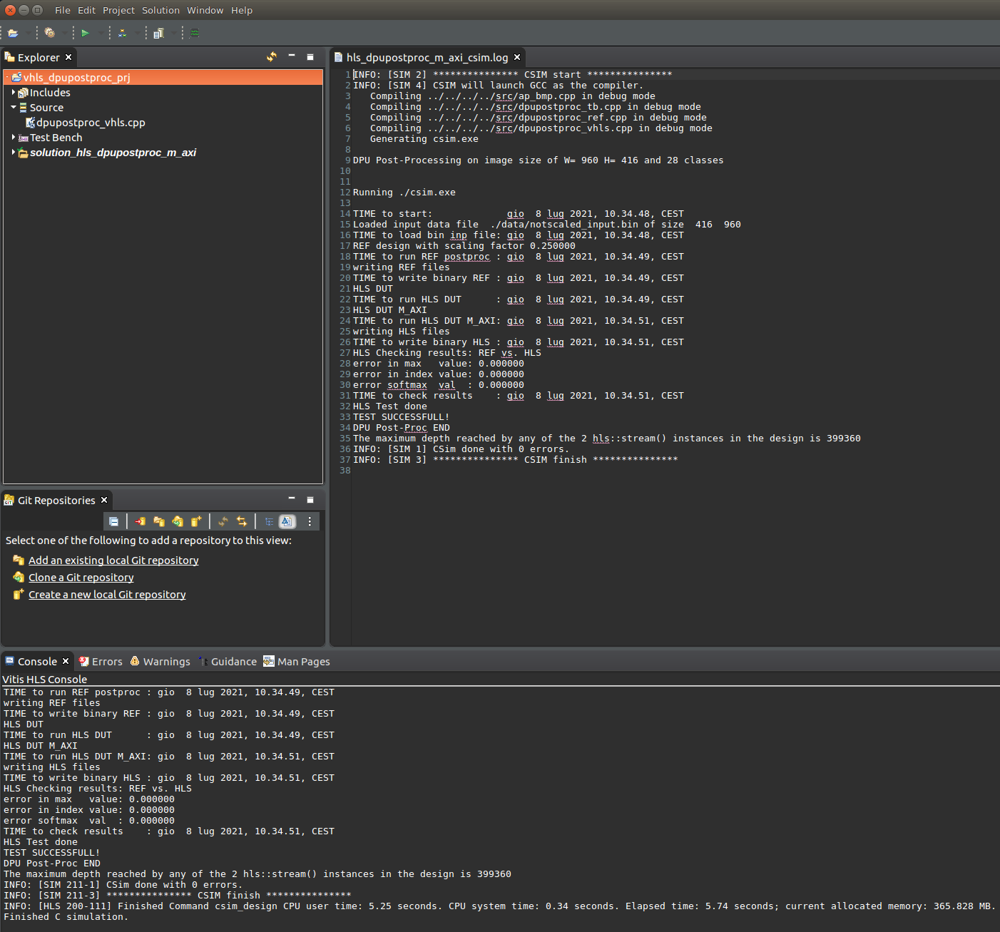

*Figure 5. Post-processing CSIM step with Vitis HLS*


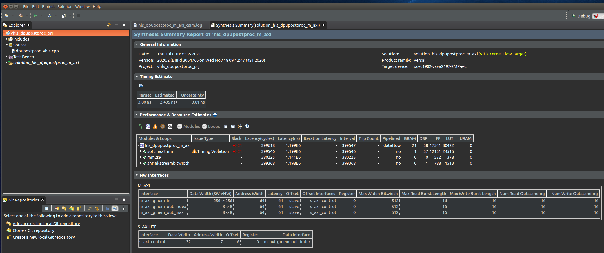

*Figure 6. Post-processing SYN step with Vitis HLS*

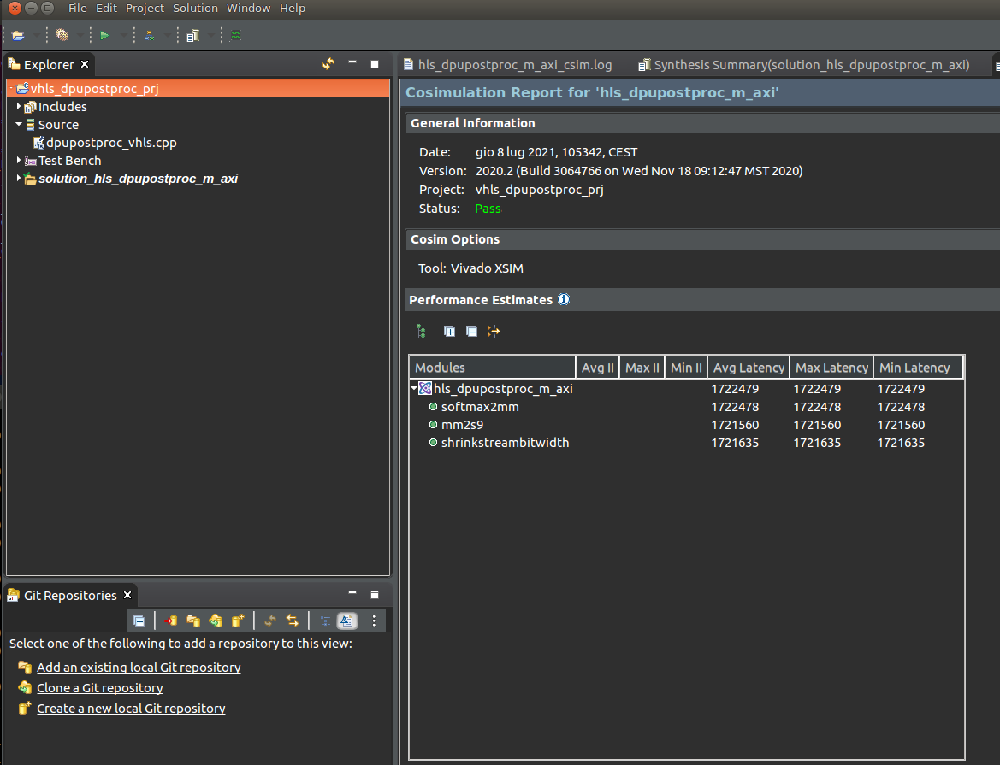

*Figure 7. Post-processing coSIM step with Vitis HLS*


*Figure 8. Post-processing IMP step with Vitis HLS*


Note that the file [dpupostproc_defines.h](files/postproc/hls/src/dpupostproc_defines.h) must have the line ``#define ARM_HOST`` commented.

As you see from Figure 8, after Place-And-Route, the accelerator consumes the following resources: 14347 LUT, 17395 FF, 38 BRAM, and 58 DSP from the  Versal 1902 device, with a minimum clock period of 2.891ns. This period corresponds to  345MHz maximum clock frequency.

Figure 7 reports the cycle accurate simulation (coSIM step) considering the amount of clock cycles to process the whole image before sending it back to DDR memory. The latency of this kernel is given by 1722479 (cycles) x 2.981ns (clock period) = 5.134ms.

Even assuming a longer clock period of 5ns (corresponding to 200MHz clock frequency), the latency would become 8.61ms.

**Note:** This latency is the time to process the entire frame (860x416x28) of data because this is the way Vitis HLS works if you want to do a functional cycle accurate simulation (acknowledged as "coSIM") of the accelerator. But this core in itself has a real latency of few dozens of clock cycles. Such effective latency could be exploited either by using AXI4 Streaming interfaces (which are not accepted by the DPU core because it cannot work in a streaming mode) instead of full MAXI4 interfaces or by adding a ping-pong buffer of few image lines among the Post-processing accelerator and the external DDR memory.  


# 3 Vitis GUI-based Design Flow

This section explains how to build the embedded system project with the Vitis GUI, now that you have developed the two accelerator kernels as standalone HLS projects. You must have the following ``platform`` and ``petalinux`` folders/files related to the ``XVDPU TRD`` platform design:

```text
# TRD platform file
ZF_VDPU_TRD/platform/vck190_dpu/vck190_dpu.xpfm
# Sysroot path
ZF_VDPU_TRD/petalinux/xilinx-vck190-base-trd/images/linux/sdk/sysroots/aarch64-xilinx-linux/
# Root FS file
ZF_VDPU_TRD/petalinux/xilinx-vck190-base-trd/images/linux/rootfs.ext4
# Linux Kernel Image file
ZF_VDPU_TRD/petalinux/xilinx-vck190-base-trd/images/linux/Image
```

Since the DPU core is not yet in this design, the two PL accelerators work with the pre-defined scaling factors. In the real application, the information about such scaling factors should arrive by searching for the  ``fix_point`` attributes of the input and output tensors of the CNN subgraph running in the DPU.


## 3.1 Pre- and Post-processing Kernels Together

This section contains the instructions to create an embedded system design in which both the Pre- and Post-processing kernels are working in parallel (on different data).

This step is performed after creating an embedded system with only one kernel at a time and functionally testing the kernel.
The host code was written in a way to encapsulate the code related to each kernel so that they could work in parallel without any interference.  
If you look at the [host_preproc_xrt.cpp](files/preproc/vitis/host/host_preproc_xrt.cpp) and
[host_postproc_xrt.cpp](files/postproc/vitis/host/host_postproc_xrt.cpp) files you will note that the ``main()`` routine is embedded by ``#ifndef TWO_KERNELS``.

Since the instructions to create the standalone projects are similar, I prefer to describe here those steps, once, for the sake of conciseness.

1. From Vitis GUI create a new **application project** and select the ``vck190_dpu.xpfm`` file associated to the ``XVDPU TRD`` **platform** design, as shown in Figure 9.

2. Select the ARM Cortex A72 as **application domain** and fill the appropriate **Sysroot path** , **Root FS** and Linux **Kernel Image** tags, with the above mentioned files. See Figure 10.

3. Select the "AI Engine System Design Examples -> Empty Application" as design template. See Figure 11. Then set the **Active build configuration** to **Hardware**.

4. Delete the subproject "two_kernels_kernels" as shown in Figure 12.

5. Click the File menu and select `New->Hw Kernel project` and give it a name such as "postproc". It will be the subsystem of the post-processing accelerator (or kernel). Make sure to select the "two_kernels" as "system project name". See Figure 13.

6. Now import the following three files of source code for such accelerator:  [dpupostproc_vhls.cpp](files/postproc/vitis/kernels/dpupostproc_vhls.cpp), [dpupostproc_defines.h](files/postproc/vitis/kernels/dpupostproc_defines.h) (this one with  ``#define ARM_HOST`` commented) and
[lut_exp.h](files/postproc/vitis/kernels/lut_exp.h). See Figure 14.

7. Click the  ``postproc.prj`` file and select the top level function ``hls_dpupostproc_m_axi``, which is the name of the accelerator in this Vitis flow.  Right click the "postproc" kernel in the project Explorer (on the left) and select "Build". Ensure that you first put the **Active build configuration** to **Hardware**. See Figure 15.

8. Similarly to steps 5 and 6, you now create the Pre-processing kernel. Click the File menu, select `New->Hw Kernel project`, and give it a name such as as "preproc". This will be the subsystem of the pre-processing accelerator. Now add the source code files [dpupreproc_vhls.cpp](files/preproc/vitis/kernels/dpupreproc_vhls.cpp) and [dpupreproc_defines.h](files/preproc/vitis/kernels/dpupreproc_defines.h) (this last one with  ``#define ARM_HOST`` commented).

9. Similarly to step 7, click the ``preproc.prj`` file and select the top level function ``hls_dpupreproc_m_axi``, which is the name of the accelerator in this Vitis flow. Right-click the "preproc" kernel in the project Explorer (on the left) and select "Build". Make sure that you  first put the **Active build configuration** to **Hardware**. See Figure 16.

11. Now, import all the necessary files for the host application from [preproc/vitis/host](files/preproc/vitis/host) and [postproc/vitis/host](files/postproc/vitis/host). At the end of the process, you will see what is shown in Figure 17. You need also to add the file [host_main.cpp](files/two_kernels/host_main.cpp).

12. Now you have to set the **C/C++ Build Settings** for the host application. Right-click "two_kernels[linux on psv_cortexa72]" in the project Explorer and select "C/C++ Build -> Settings -> Dialect." Choose **ISO C++1y**. Add the ``TWO_KERNELS`` macro in the ``Preprocessor`` settings. See Figure 18.

13. In the **C/C++ Build Settings**, remove the OpenCL library and  add the XRT ``xrt_coreutil`` library.   See Figure 19.

14. Right-click the "two_kernel_system[vck190_dpu]" and launch the "Build" action. You will have to wait for a few minutes depending on your host PC. The ``sd_card`` to boot the Linux OS on the VCK190 PP board together with the ``binary_container_1.xclbin`` bitstream to program the device will be created at the end of this process.

15. Prepare a new SD card to boot the VCK190PP by writing the file ``sd_card.img`` with an utility like ``Win32DiskImager`` (on my Windows10 OS laptop). See Figure 20.


**NOTE**
Most of the the above mentioned actions could be skipped by opening the Vitis GUI and importing the Vitis archive [two_kernels_system.ide.zip](files/two_kernels/two_kernels_system.ide.zip).
However, you have to manually adapt the *TRD platform file*, the *Sysroot path*, the *Root FS file* and the *Linux Kernel Image file* to have it correctly working.


*Figure 9. Vitis GUI flow: selecting the platform file*

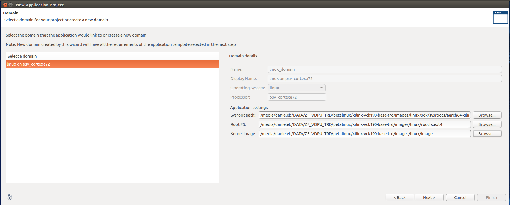

*Figure 10. Vitis GUI flow: setting the domain specific tags*


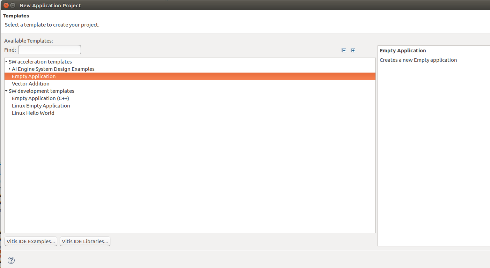

*Figure 11. Vitis GUI flow: design template selection*


*Figure 12. Vitis GUI flow: remove the "two_kernels_kernels" subproject*


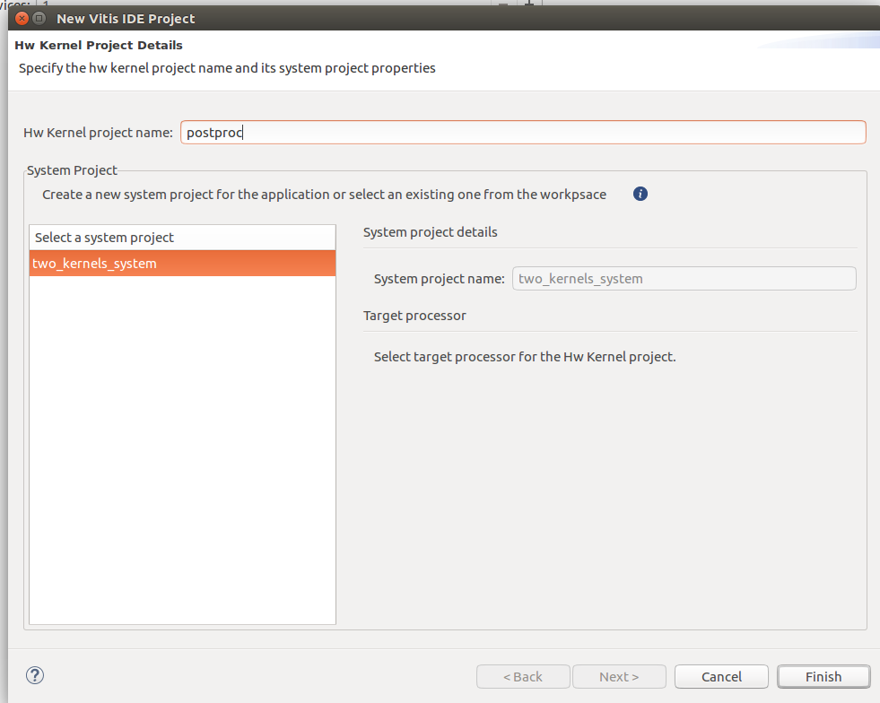

*Figure 13. Vitis GUI flow: add the "postproc" kernel subproject*

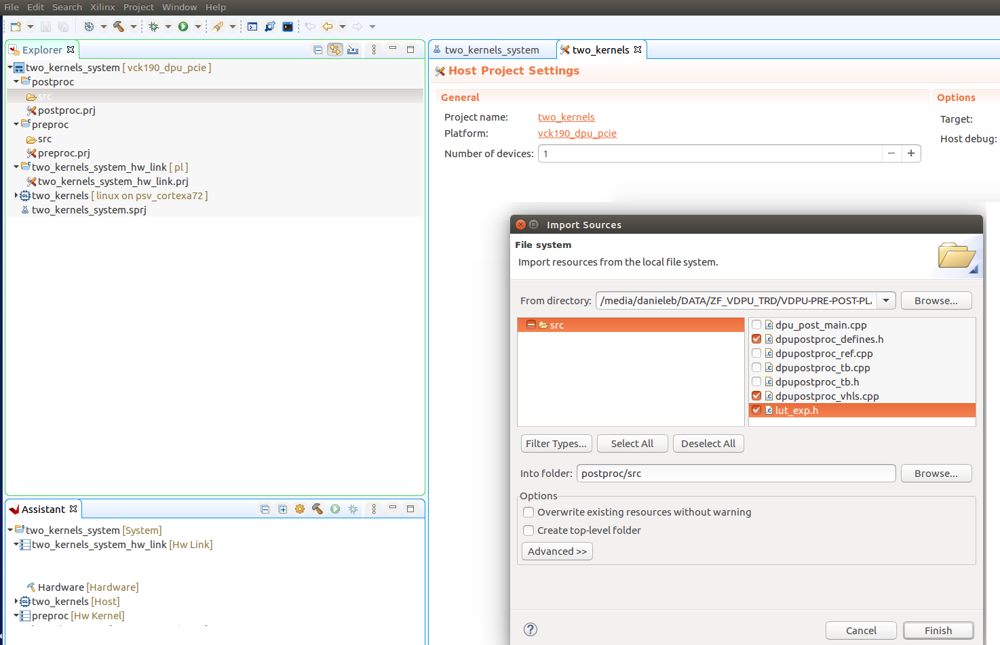

*Figure 14. Vitis GUI flow: add the source code files to the "postproc" kernel*


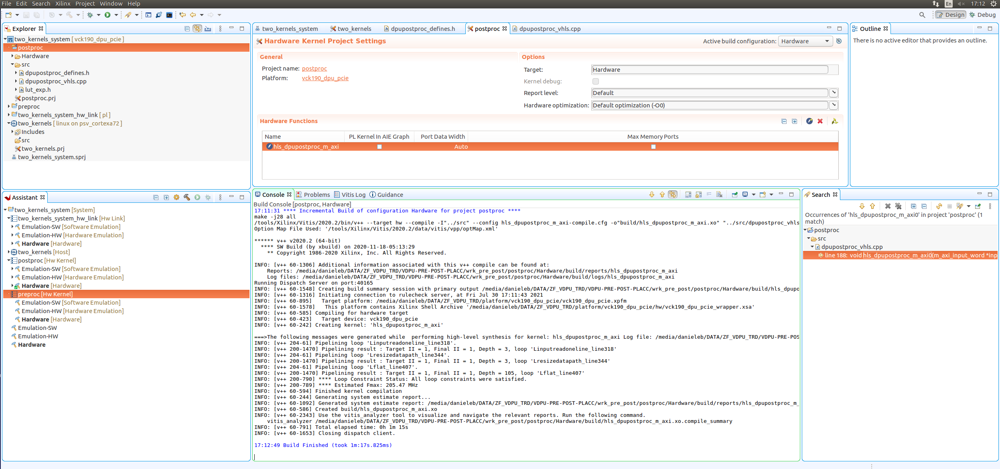

*Figure 15. Vitis GUI flow: build the "postproc" kernel*


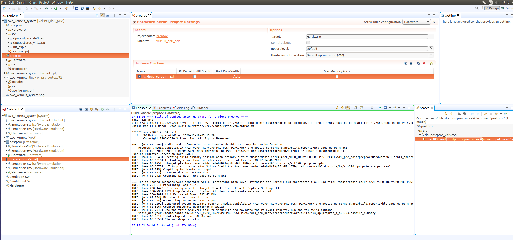

*Figure 16. Vitis GUI flow: build the "preproc" kernel*


*Figure 17. Vitis GUI flow: import the source code for the host application*

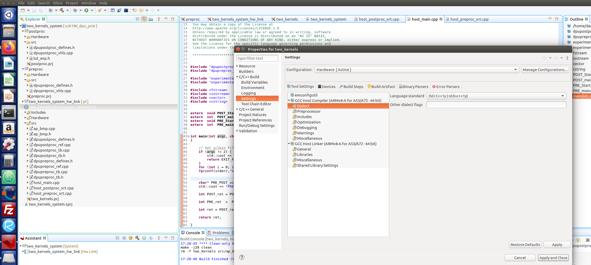


*Figure 18. Vitis GUI flow: ISO C++1y dialect set to compile the host application (top) and preprocessor defines (bottom)*


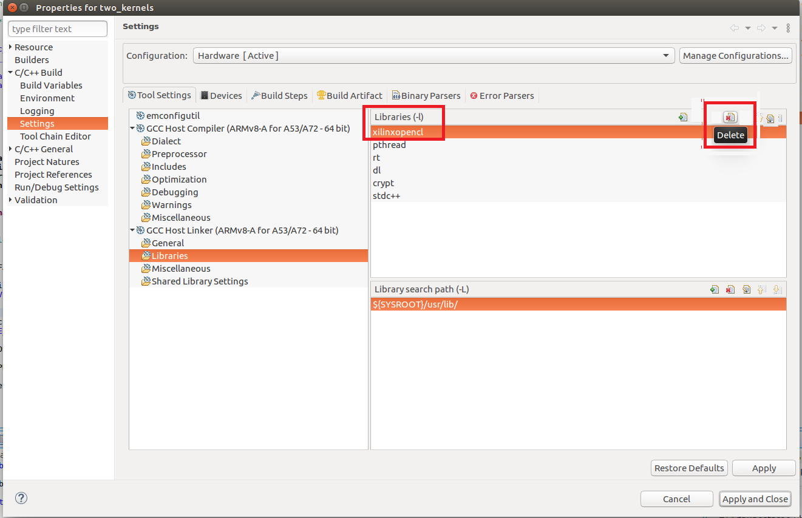

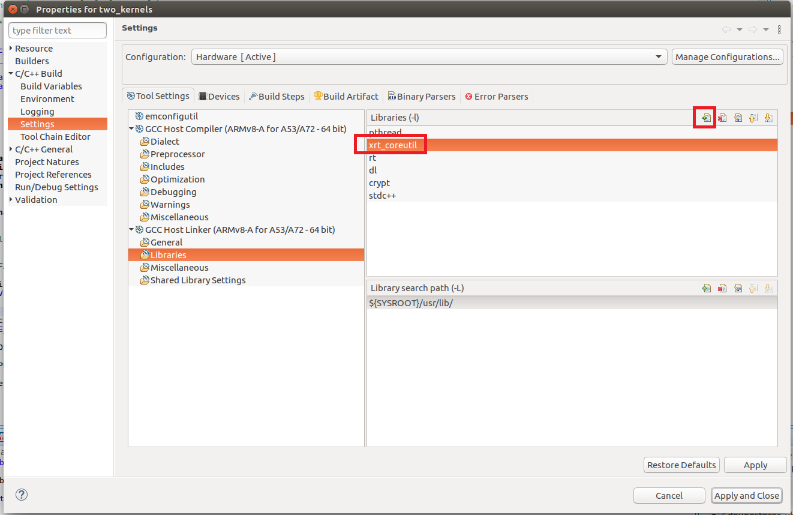

*Figure 19. Vitis GUI flow: adjust the libraries to compile the host application,
by removing ``xilinxopencl`` (top) and adding ``xrt_coreutil`` (bottom)*

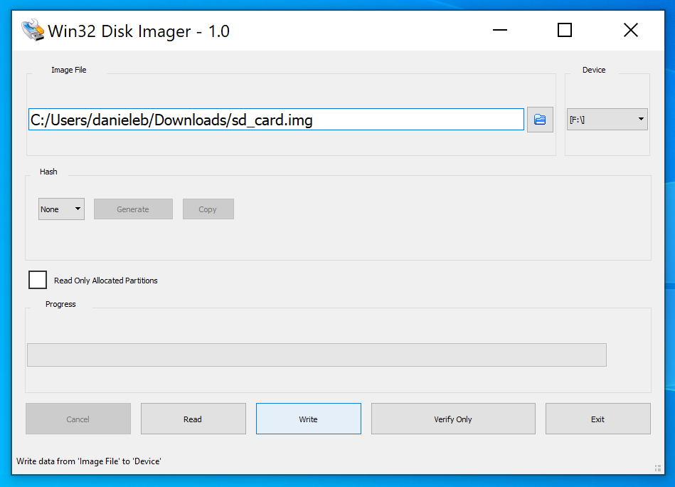

*Figure 20. Write the sd card to boot the VCK190PP target board*


## 3.2 System Debug of the Kernels Together

1. Now turn on and boot your VCK190PP target board. Ppen a **PuTTY** terminal from your host PC to communicate in UART directly with you target board. As shown in the the right side of Figure 21, set the board IP Address (for example: 190.1268.1.200) with the following command running it on the PuTTY terminal:
```shell
ifconfig eth0 192.168.1.200
```

2. To test the two PL kernel at runtime on the target board, you have to transfer their input data. Use a file-transfer (``scp`` based) utility like FileZilla and copy the data folders [data_post](files/postproc/hls/data_post) and [data_pre](files/preproc/hls/data_pre) from your host PC to the folder ``/mnt/    `` of the target board. See the left part of Figure 21.  

3. Right-click the "two kernels system[vck190-dpu]" project explorer and select "Debug Configurations", and then double click the "System Project Debug", as shown in Figure 22.

4. Set the "Linux Agent" for the debug server using the same IP address of item 1 above, as shown in Figure 23.

5. Run the debugger. You should see the positive results reported in Figure 24.

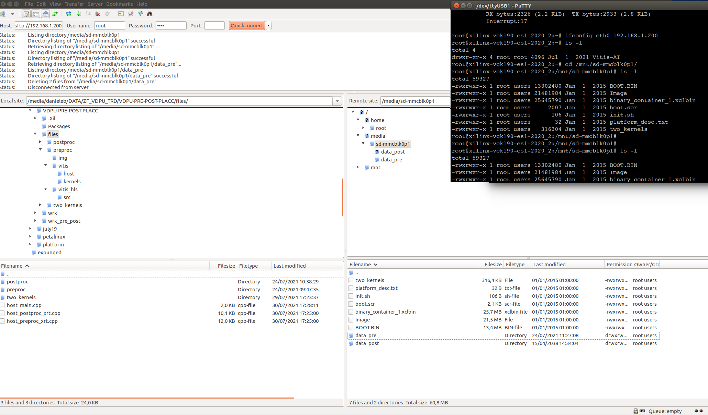

*Figure 21. Debug flow: file transfer of accelerator I/O data between host PC and target board*


*Figure 22. Debug flow: setting the Debug Configurations*

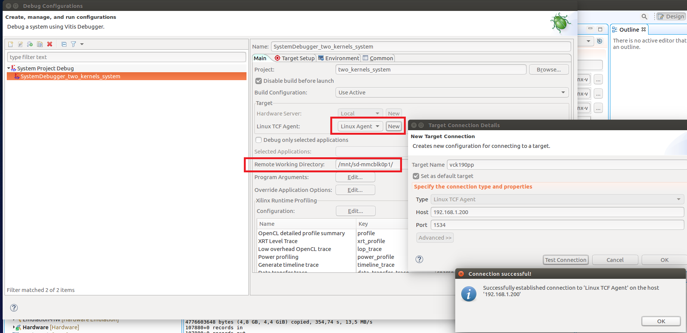

*Figure 23. Debug flow: set the Linux agent between host and target*

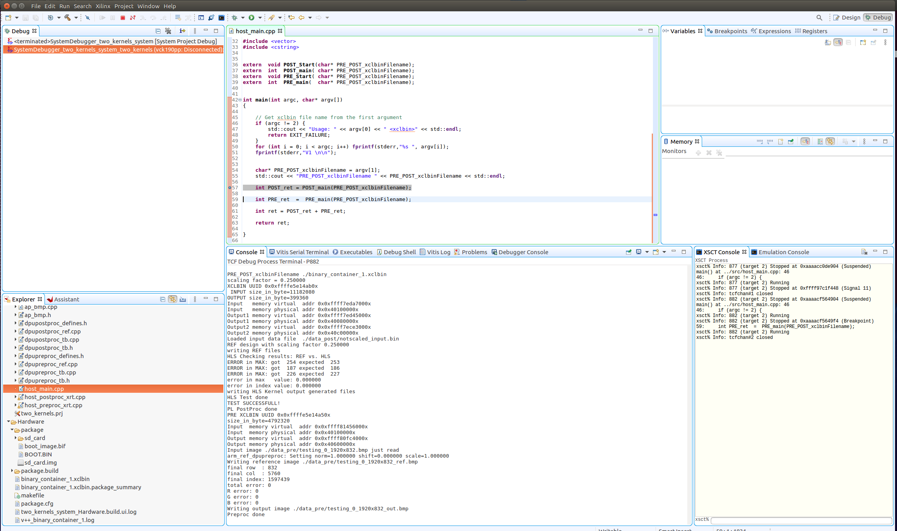

*Figure 24. Debug flow: test ended successfully*

# 4 Vitis Makefile-based Design Flow with Versal DPU

When adding also the DPU software application to the PL pre- and post-processing accelerators, you have to temporarily leave the Vitis GUI-based flow and use the Makefile-based flow.


## 4.1 Compile the Host Applications with Makefile

Assuming you have properly setup the Vitis environment, the complete software application with the cascade of the three kernels (pre-processing, DPU, post-processing)
can be compiled with the Vitis Makefile-based flow, by launching the following commands in the [Makefile](files/makefile_flow/host_apps/Makefile) from the [host_apps](files/makefile_flow/host_apps):

```shell
cd VDPU-PRE-POST-PLACC/files # you are supposed to be here
cd makefile_flow
bash -x ./run_makefile_flow.sh
```

These commands will compile the host applications with a Makefile flow for the standalone pre-processing (``preproc`` folder; the application is named ``host_preproc_xrt``),
the standalone post-processing (``postproc`` folder; the application is named ``host_postproc_xrt``) and the cascade of `preprocessing -> DPU -> postoprocessing` (``pre2post`` folder; the application is named ``pre2post``).

**Note:** In the ``run_makefile_flow.sh`` script the following environmental variables need to be correctly set:
```shell

#change the following two directories according to your needs
export VDPU_PRE_POST_PL_ACC=/media/danieleb/DATA/ZF/new_VDPU-PRE-POST-PL-ACC/files
export       DB_FATHER_PATH=/media/danieleb/DATA/ZF/ZF_ProAI-main/NEW_ZF_PACKAGE_FINAL
```

## 4.2 Run the Host Applications on the Target VCK190 board

You can create, archive, and copy it on your VCK190 target board with the ``scp`` utility (assuming your board has a certain IP address ``VCK190_IP_ADDRESS``):
```shell
#from HOST PC
cd VDPU-PRE-POST-PLACC/files # you are supposed to be here
cd makefile_flow
# -h to replace softlinks with real files
tar -hcvf host_apps.tar ./host_apps
# transfer archive from host to target
scp host_apps.tar root@VCK190_IP_ADDRESS:~/
```
Work on the UART terminal of your target board with the following commands:
```shell
#FROM TARGET BOARD
tar -xvf host_apps.tar
cd host_apps
bash -x ./run_all_acc.sh | tee logfile_host_apps_vck190p.txt
```

You should see something similar to the contents of [logfile_host_apps_vck190p.txt](files/makefile_flow/img/ logfile_host_apps_vck190p.txt) file.

Each host application generates an output that perfectly matches the reference:
- The standalone ``preproc`` PL kernel generates the  ``testing_0_1920x832_out.bmp``  image that is bit-by-bit equal to the ``testing_0_1920x832_ref.bmp``  image produced by the software task running on the ARM CPU as reference

- The standalone ``postproc`` PL kernel generates the  ``pl_hls_index.bin``  binary file that is bit-by-bit equal to the ``arm_ref_index.bin``  binary file produced by the software task running on the ARM CPU as reference

- The processing chain ``pre2post`` composed by the cascade of ``preproc``, ``dpu``, and ``postproc`` kernels produces the outputs of Figures 25 and 26 and the output files ``post_uint8_out_idx.bin`` (PL pre-precessing, DPU, and PL post-processing kernels) and ``post_uint8_ref_idx.bin`` (DPU and ARM sw post-processing task) perfectly match each other.


*Figure 25. Pre-processing output data, represented  as an image.*


*Figure 26. Post-processing output data, represented  as an image. On the left the input image, on the right the output segmented image.*


## 4.3 Debug the Host Application with Vitis GUI

Besides running the host applications directly on the target board as commands, you can use the Vitis GUI and debug the application one step at a time, as shown here:

```shell
cd VDPU-PRE-POST-PLACC/files # you are supposed to be here
cd makefile_flow/host_apps/pre2post/src/
vitis -debug -flow embedded -os linux -host-exe-file ../../../../host_apps/makefile_flow/pre2post/pre2post -program-args "/home/root/pre2post/model/fcn8.xmodel /home/root/pre2post/data_pre2post/dataset1/img_test/ 1 1 1" -host VCK190_IP_ADDRESS -target-work-dir /home/root/pre2post
```

Ensure that you are not making any mistake with the directory names and levels in the host or in the target. Any mistakes cause the GUI not to pop-up correctly.  

You should see something similar Figure 27:

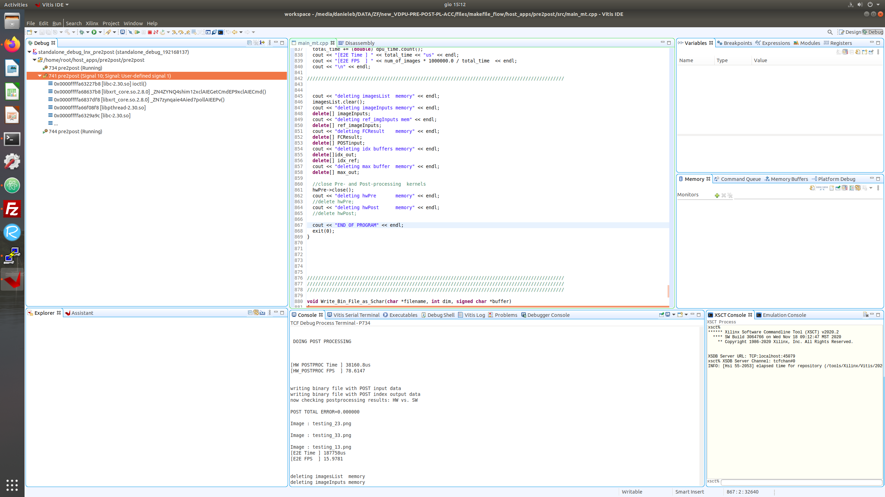

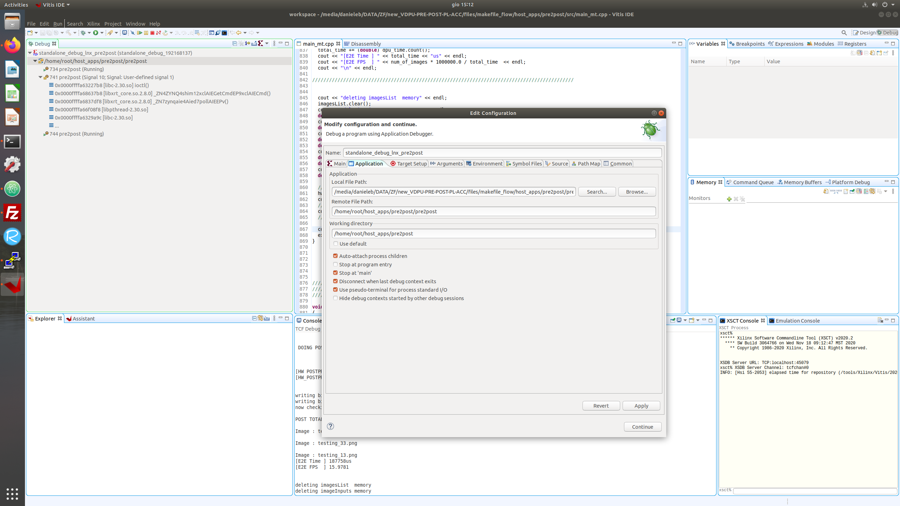

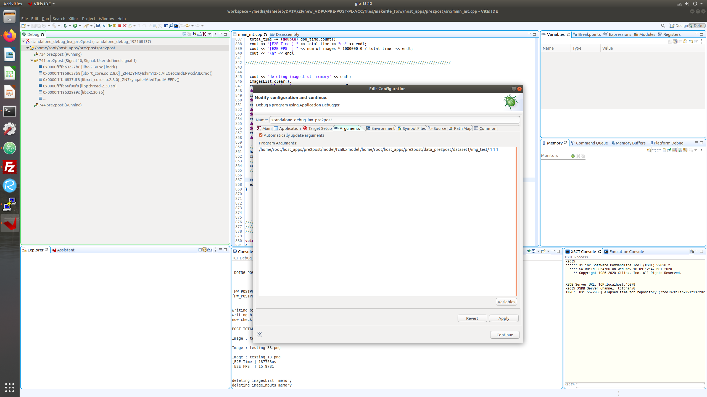

*Figure 27. Vitis GUI to debug the application with pre- and post-processing and DPU kernels*


# Conclusion

When the semantic segmentation CNN is executed with a single thread on the system composed by DPU and  pre- and post-processing PL accelerators you can note the following throughput performance in terms of average ``fps`` (frames per second):
- Pre-processing  task: 37fps by the PL accelerator vs. 3fps by the ARM CPU software task
- Post-processing task: 78fps by the PL accelerator vs. the ARM CPU software task
- DPU task: 51fps.


**Note:** The latency of the PL accelerators could be further reduced by making them to work in purely streaming dataflow mode.


<hr/>
<p align="center"><sup>Copyright&copy; 2021-2022 Xilinx</sup></p>
