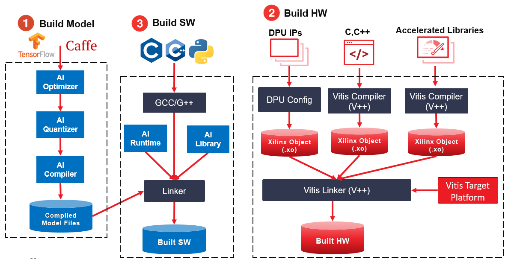
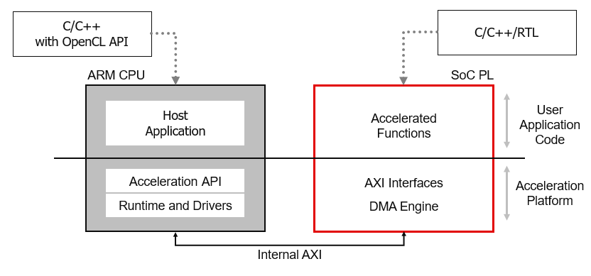

# Vitis and Vitis AI Workflow

The Vitis&trade; unified software platform enables the development of embedded software and accelerated applications on heterogeneous Xilinx platforms, including FPGAs, SoCs, and Versal&trade; ACAPs. It provides a unified programming model for accelerating Edge, Cloud, and Hybrid computing applications.

## Layered Vitis Software Platform Workflow

Vitis software platform has a layered architecture. It helps engineers to focus on their target and easily exchange work results. For example, data scientists or machine learning engineers only need to work on domain-specific development environments. The result can be converted to Vitis-AI consumable format for further deployment. Application developers take the machine learning model from data scientists and adapt it to the accelerated libraries provided by Xilinx or partners. Vitis Core Development Kit, runtime and platform layered architecture ensure the service API is stable and provides cross-platform support. The workload to enable a new platform on hardware would be minimal.

There are commonly three types of workflows targeting different persona for Vitis and Vitis AI evaluation and development.

| Workflow           | Target Persona                                               | Highlights in the Flow                                       |
| ------------------ | ------------------------------------------------------------ | ------------------------------------------------------------ |
| Evaluation Flow    | Subject-matter Experts (e.g. Data Scientists)           | Use your industry standard tools plus Xilinx&reg; adapters to evaluate accelerated libraries' performance on Xilinx platforms.
Minimal Xilinx-specific toolset requirement. No need to install Vitis or PetaLinux.
Vitis AI toolsets are used here for Data Scientists to evaluate machine learning features. |
| Development Flow   | Application Developers                                       | Explore the possibilities with Vitis acceleration on Xilinx platforms. Assemble Xilinx or partner accelerated libraries or develop your own acceleration kernel. No need to install PetaLinux. |
| Customization Flow | Platform Developers (e.g. Hardware engineers and BSP engineers) | Advanced customization on Xilinx platforms or your own hardware for more input and output interfaces, embedded Linux kernel, and root file system configurations, etc. |

At different stages of project development, you can focus on different flows. This tutorial gives the introduction in a layered manner: starting from evaluation flow to introduce what one can do in Machine Learning with minimal Xilinx-specific knowledge to more customization of Xilinx technology for more performance optimization and flexibility. Please refer to each chapter introduction to understand its target group.

## Vitis AI Workflow

Vitis AI is Xilinx’s development stack for AI inference on Xilinx hardware platforms, including both edge devices and Alveo&trade; cards. It consists of optimized IP, tools, libraries, models, and example designs. It is designed with high efficiency and ease of use in mind, unleashing the full potential of AI acceleration on Xilinx FPGA and ACAP.

Vitis AI includes the following key components:
- AI Model Zoo: a comprehensive set of pre-optimized models that are ready to deploy on Xilinx devices.
- AI Optimizer: an optional model optimizer that can prune a model by up to 90%. It is separately available with commercial licenses.
- AI Quantizer: a powerful quantizer that supports model quantization, calibration, and fine-tuning.
- AI Compiler: compiles the quantized model to a high-efficient instruction set and data flow.
- AI Profiler: performs an in-depth analysis of the efficiency and utilization of AI inference implementation.
- AI Library: offers high-level yet optimized C++ APIs for AI applications from edge to cloud.
- DPU: efficient and scalable IP cores that can be customized to meet the needs of many different applications.

When using Vitis AI, there are three steps in general which are shown in the following diagram, including:

- Model development: train models or get models from Vitis AI model zoo, use Vitis AI optimizer (optional), quantizer, and compiler to convert float models into DPU instruction files.
- Hardware development: use Vitis tool to integrate DPU IP and other kernels with the platform and generate board boot files.
- Software development: implement model deployment codes using VART or Vitis AI library, finish application-level software development, and generate executable running on board.

To quickly evaluate machine learning models on Xilinx evaluation boards, data scientists only need to run through step 1 and step 3 because the hardware build in step 2 is released by Xilinx and can be the further customized by corresponding developers using development flow and customization flow.

## Vitis Workflow

To enable hardware acceleration, the code is split between a host and one or several kernels.  The host program, written in C/C++ uses API abstractions like OpenCL, and runs on a host processor (a x86 server or an  ARM processor in the case of embedded platforms).  The hardware  accelerated kernels run onto the programmable logic of a Xilinx device.

The API calls, processed by Xilinx runtime (XRT), manage process  transactions between the host program and the hardware accelerators  (kernels). Communication between the host and the kernel(s), including  control and data transfers, occurs across the PCIe® bus or an AXI bus for embedded platforms.

In a typical application, the host first transfers data for the kernel to operate from host memory into global memory. The  kernel subsequently operates on the data, storing results back to the  global memory. After kernel completes, the host transfers the results  back into the host memory. Data transfers between the host and global  memory introduce latency, which can be costly to the overall  application. To achieve acceleration in a real system, the benefits  achieved by the hardware-acceleration kernels must outweigh the added  latency of these data transfers.

The Vitis core development flow helps manage, configure, build, and run a host application and hardware accelerated kernels.

- The host application is developed in C/C++ with OpenCL™ API calls
- The hardware kernels can be developed in C/C++, OpenCL C, or RTL.

The following is an image of the functional blocks involved for the application on ARM to control PL kernels.

## Workflow in this Tutorial

This tutorial guides you from high level to low level in a step-by-step manner:

- It starts from the development environment setup in Section 2.

- Modules 1 to 3 in Section 3 introduce the Vitis AI demo setup.
- Module 4 guides you through the CIFAR10 classification example using Vitis AI and TensorFlow.
- Module 5 explains how to switch to other networks. All above are on the "Evaluation Flow" level for Data Scientists for Vitis-AI workflow.

- Section 3 Module 6 introduces how to use Vitis Libraries to speed up pre or post-processing for machine learning applications. It brings performance optimization at the system level. It's a step in "Development Flow" in the scope of Vitis workflow.

Copyright&copy; 2020-2022 Xilinx

